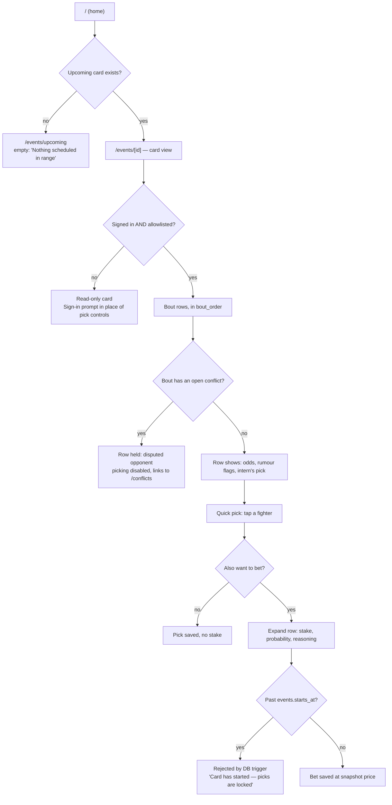
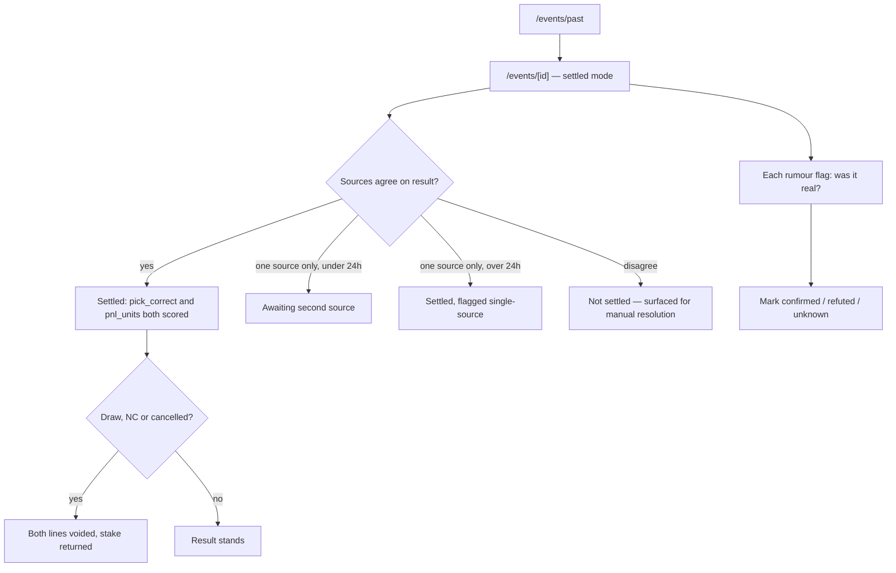
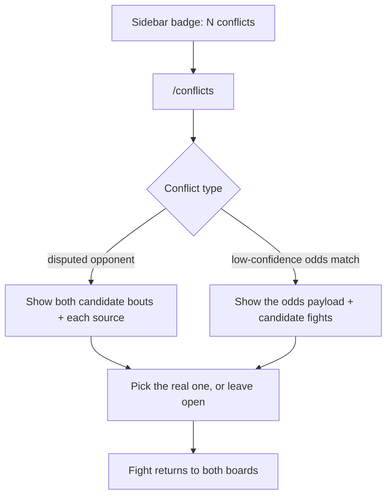

# User Flows — v2

**Scope:** v2 (solo Fight IQ tool). Written 2026-08-29, after `app-architect`
and `harness-setup`.

**Inputs:** [PRD.md](PRD.md) (product truth), [ARCHITECTURE.md](../ARCHITECTURE.md)
(entities, 7 resolved forks).

**Reads this next:** `roadmap-planner`, which sequences phases against the
screen dependencies below.

---

## One user type

There is exactly one: **the owner**. No admin, no viewer, no guest. The sync,
odds, and intern jobs are infrastructure, not users.

A logged-out visitor is not a user type either — they can read the public
fighter/event catalog, and that is all. Everything that makes this a Fight IQ
tool is owner-only.

---

## Screen inventory — 11 total, 2 genuinely new

Counted explicitly so a partial list is visibly incomplete.

| # | Route | Status | Purpose |
|---|---|---|---|
| 1 | `/` | exists (redirect) | Redirects to the **next upcoming card** |
| 2 | `/events/upcoming` | shipped | List of upcoming cards |
| 3 | `/events/past` | shipped | List of past cards |
| 4 | `/events/[id]` | shipped, **heavily extended** | **The primary working surface.** See below |
| 5 | `/fighters` | shipped | Fighter search/list |
| 6 | `/fighters/[id]` | shipped | Fighter profile |
| 7 | `/fights/[id]` | shipped | Single-bout detail, tale of the tape, full rumour sources |
| 8 | `/scoreboard` | **NEW** | Two boards: units and accuracy |
| 9 | `/conflicts` | **NEW** | Review queue — disputed opponents + low-confidence odds matches |
| 10 | `/clans`, `/clans/[id]`, `/invite/[token]` | **FROZEN** | Reachable, removed from nav, no further work |
| 11 | `/auth/callback` | shipped | OAuth callback (a route, not a screen) |

**Deliberately not separate screens**, to keep the count honest:

- **Pick history** lives on `/scoreboard` as a filterable table under the two
  boards, not its own route. The PRD's breakdowns (weight class, stance
  matchup, favourite vs underdog, flag present) are filters on that table.
- **Rumour outcome marking** (UC-5) happens on `/events/[id]` in settled mode,
  next to the flag it judges — not in a separate review tool. You mark whether
  a flag was real while looking at the fight it was about.
- **Job health** is a banner in the app shell, not a screen. A missed odds
  snapshot surfaces there with a manual re-pull action on the affected card.

---

## Navigation — a deliberate decision, not a default

**Convention: the existing collapsible left sidebar plus top bar**
(`AppShell` / `Sidebar` / `TopBar`). Unchanged — it is shipped, it works, and
a layout change is not part of this scope.

Nav stays at **four items**, swapping the frozen surface for the new one:

| Before | After |
|---|---|
| Upcoming Events | Upcoming Events |
| Past Events | Past Events |
| Fighters | Fighters |
| ~~Clans~~ | **Scoreboard** |

**`/` needs no nav slot** — it redirects to the next card, and the app name in
the top bar returns there. Home is "the card you're working on."

**`/conflicts` is deliberately not a permanent nav item.** It appears as a
badge on the sidebar only when the open-conflict count is greater than zero.
Rationale: it is empty almost always, and a permanently visible queue that is
permanently empty trains you to ignore it — the same failure as an
always-red CI gate. When it is non-empty it must be impossible to miss,
because an unresolved conflict silently withholds fights from both boards.

---

## Flow 1 — Scout and pick a card (UC-1, UC-2)

The core loop. Everything else is secondary to this working well.



**Why the card view and not the fight page.** You work a card in one pass. If
picking meant twelve round trips to `/fights/[id]`, you would lose the
card-level comparison exactly when you need it, and the step count would be
dishonest. `/fights/[id]` still exists for depth — full tale of the tape,
every rumour source with its links — reached by opening a bout.

### Progressive disclosure on a bout row

- **Collapsed** — fighters, `bout_order`, decimal odds, rumour-flag badge,
  intern's pick, your pick. One tap picks a winner.
- **Expanded** — stake in units, your estimated probability, optional method,
  reasoning. Only opens when you actually want to bet.

### A UX floor problem worth naming now

**Asking "what probability do you give this fighter?" cold is a bad prompt.**
Almost nobody can produce a calibrated number from nothing, and a form that
demands one fails the no-learning-curve bar on its most important field.

The expanded row must therefore **show the implied probability from the price
first** (`1 / decimal_odds`), and let the estimate be expressed against that
anchor — you are answering "is the market too high or too low here, and by how
much," which is the judgment you actually have. **The edge must be computed and
displayed live** as the estimate moves, so the bet/no-bet decision is visible
rather than arithmetic done in your head.

This is recognition over recall applied to the one number the whole system
depends on. Without it, `estimated_probability` becomes noise, and the
calibration check it exists to enable becomes meaningless.

---

## Flow 2 — Settle and review (UC-4, UC-5)

Same route as Flow 1 in a different state — `/events/[id]` for a past card.
No new screen.



Marking a flag's outcome is what makes the PRD's rumour precision metric
measurable. It sits beside the flag, on the card you already have open.

---

## Flow 3 — Read the scoreboard (UC-4)

```text
/scoreboard → Board 1 (units) + Board 2 (accuracy) → filterable pick table
```

Linear, no branching. Both boards always show all three lines — you, the
intern, chalk — because a line that disappears when it has no data reads as a
bug and hides the control you most need.

---

## Flow 4 — Resolve a conflict



Most conflicts never reach this screen — they self-resolve on source
convergence or on a confirmed result. This exists for the residue.

---

## Auth gates

| Surface | Logged out | Logged in, not allowlisted | Owner |
|---|---|---|---|
| `/events/*`, `/fighters/*`, `/fights/[id]` | read-only | read-only | full |
| Pick/bet controls | sign-in prompt in place | "not available" | full |
| `/scoreboard`, `/conflicts` | sign-in prompt | "not available" | full |
| Frozen clan routes | existing v1 behaviour, unchanged | | |

**Gates render in place; they do not redirect.** This continues the shipped
pattern and is right here — there is one user who is signed in essentially
always, so a redirect would be a surprise rather than a help.

### Security baseline, applied inline (triggered by the gates above)

- [x] **The allowlist is enforced in the database, not only in the UI.**
      Done in A3 (2026-09-01) — `is_owner()` plus one restrictive RLS policy
      per writable v1 table (`supabase/migrations/0017_owner_allowlist.sql`).
      `picks` doesn't exist yet (C1); when it's built it must reuse
      `is_owner()` the same way, not re-derive the check.
- [x] The allowlist lives in **one server-side module** (`lib/auth.ts`), which
      features import. Never a client-side comparison, never duplicated. Note
      the module is UX-only — `is_owner()` in Postgres is the actual
      boundary, independent of any bug in the app layer.
- [x] The owner identity comes from the **session**, never from anything the
      client sends — `auth.uid()` resolves from the signed JWT.
- [x] The allowlist value is an **environment variable**, server-only, never
      `NEXT_PUBLIC_` (`OWNER_USER_ID`, read via `requireEnv`).
- [ ] Server Actions handle the writes, so CSRF is covered by Next's origin
      checks — but no write may live in a plain unauthenticated route handler.
- [ ] Login rate limiting is the OAuth provider's; there is no password path
      to brute-force. Nothing to add.

---

## Empty, loading, and error states

The states a real session hits first, per screen. Left undesigned, these are
where the app fails.

### `/events/[id]` — the working surface

| State | What it must show |
|---|---|
| Card not announced | "Card not announced yet" — distinct from an error |
| Before T-12h | Rows marked **unpriced**, with when prices land. Not an error |
| **Odds snapshot missed** | **Loud banner** plus a manual late-pull action, accepting the worse price. The PRD calls this the highest-impact failure in the system |
| Bout disputed | Row visibly held, picking disabled, link to `/conflicts` |
| **Rumour engine degraded** | **"Flags unavailable, last scraped X"** — never a silent zero, which is indistinguishable from "nothing to report" |
| Reddit stale | Flags shown, stamped with their age |
| Picks locked | Controls disabled with the reason, not hidden |
| Loading | Bout list streams first; flags and odds fill in per row. The list must never block on the rumour query |

### `/scoreboard`

| State | What it must show |
|---|---|
| **No settled picks** | The state for the first card or two. "No settled picks yet — the chalk line appears after the first card." A blank chart here is a failure |
| Small sample | Boards render, explicitly marked as a small sample. The PRD's target is 10 cards; anything less must not read as a verdict |
| Unpriced picks | Counted in accuracy, excluded from units, and said so on screen |

### `/conflicts`

| State | What it must show |
|---|---|
| **Empty** | The *good* state. "Nothing needs review" should feel resolved, not broken or blank |
| Resolved item | Confirmation that the fight has returned to both boards |

---

## UX floor check

| Rule | Verdict |
|---|---|
| One obvious primary action | Pass. Card view: pick a fighter. Conflicts: resolve. Scoreboard is a reading screen — its headline is the three-line comparison |
| Recognition over recall | Pass, **conditional on** implied probability and live edge being shown in the expanded row. Fails without them |
| Honest step count | Pass. One screen works a whole card |
| Progressive disclosure | Pass. Collapsed rows, expanded bets, conflicts badge-gated, breakdowns behind filters |
| Restrained colour | Neutrals plus one accent. Colour carries meaning only: held/disputed, degraded, void |
| Every state designed | Pass, per the tables above |

---

## Dependencies for `roadmap-planner`

Ordering constraints that fall out of the flows, not guesses:

1. **`events.starts_at` and `fights.bout_order` precede every screen.** The
   card view cannot order bouts, and the pick lock cannot exist, without them.
2. **The odds snapshot precedes the expanded bet row**, which is built around
   implied probability and live edge.
3. **The allowlist precedes any write surface.** Shipping pick controls before
   it means a window where strangers can write.
4. **Conflict detection precedes picking**, or the first cards can take stakes
   on phantom bouts — the exact corruption the policy exists to prevent.
5. **Settlement precedes the scoreboard.** Both boards are empty without it.
6. **The rumour engine is independent** and can land any time after the card
   view. UC-1 has standalone value with no odds and no picks.
